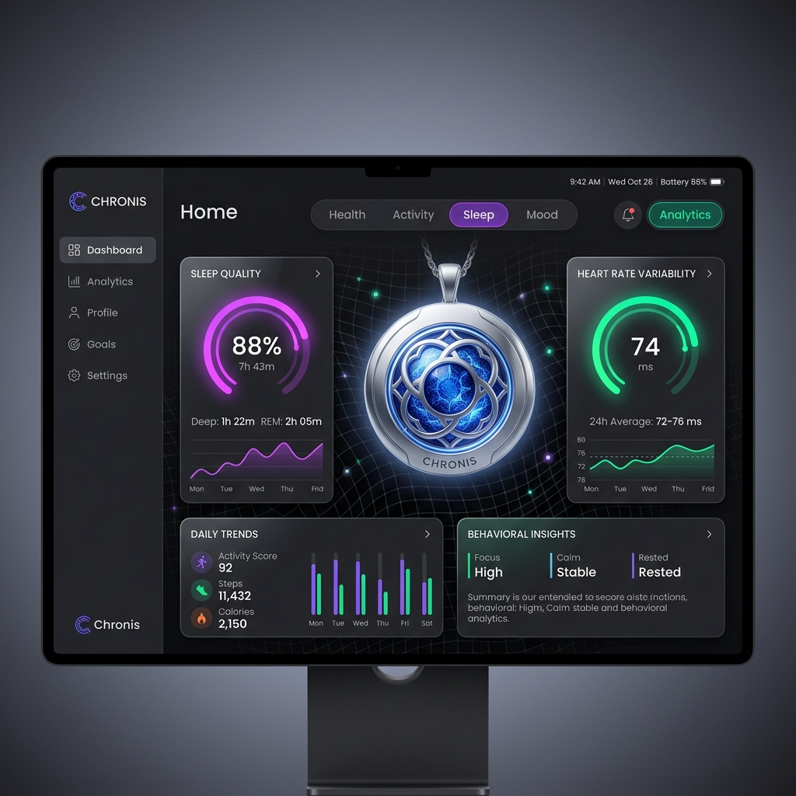

# Chronis — Behavioral Discovery & Insights Prototype

**Chronis** is an end-to-end user experience prototype designed for a mobile/web application that empowers users to explore their behavioral patterns, physiological trends, and circadian insights. 

### 🌐 Live Deployment: **[https://chornis.vercel.app](https://chornis.vercel.app)**



This repository satisfies all components of the **Chronis Product & App Engineer Hiring Assessment (Task C)**. It translates noisy sensor data into actionable human narratives using high-fidelity visualizations, contextual confidence metadata, and an interactive intervention pipeline.

---

## 🚀 Live Demo & Local Run Instructions

### Prerequisites
Ensure you have **Node.js** (v18.0.0 or higher) installed on your system.

### Local Installation & Start
1. **Clone or Navigate to the Workspace Directory**:
   ```bash
   cd Chornis
   ```
2. **Install Dependencies**:
   ```bash
   npm install
   ```
3. **Run the Development Server**:
   ```bash
   npm run dev
   ```
   *The console will output the local address (typically `http://localhost:5173`). Open this URL in your web browser to explore the dashboard.*

4. **Compile the Production Bundle**:
   ```bash
   npm run build
   ```
   *This command validates import compilation and generates the optimized production build assets in the `/dist` directory.*

---

## 🛠️ Technology Stack & Styling

- **Core Framework**: React 19 (scaffolded with Vite 8 for hot-module reloading and rapid compilation)
- **Icons**: Lucide React
- **Styling**: Pure, customized CSS (Vanilla). Avoids utility-class bloat to deliver a tailored design system.
- **Design Philosophy**: Glassmorphism dark-theme styled after modern health wearable dashboards (Oura, WHOOP). It features a dark space palette (`#0a0b10`), semi-transparent blur overlays (`backdrop-filter`), smooth micro-animations, color-coded indicators, and hover-triggered visual hints.
- **Responsive Layout**: Designed for seamless transition between widescreen desktop layouts and stacked mobile viewports.

---

## 🔍 Core Features & Components

### 1. Component 1 — Interactive Dashboard
*   **Behavioral Trends**: Real-time panels displaying Sleep Quality, Cognitive Focus, Physical Activity, and Evening Screen Time. Cards feature color-coded trending indicator badges, dynamic mini-sparkline vectors showing the last 7 cycles, and custom confidence scales.
*   **Deep Navigation Links**: Clicking any trend card immediately jumps the user to the related drill-down screen inside the *Insight Explorer* tab.
*   **Recent Changes & Drift**: Chronological log of behavioral changes compared to historical baselines (e.g., bedtime offsets, heart rate variability recovery surges, focus crashes).
*   **Calibration & Data Quality**: Transparents view of active sensor reliability (Apple Watch, Phone Usage, Desktop Work Agent, Self-Reported Logs). Integrates an **overall system confidence meter** calculated using active wear-time telemetry.

### 2. Component 2 — Insight Explorer
*   **Drill-Down Panels**: Inspects core physiological discoveries (e.g., delaying waking caffeine, digital sunsets, mid-day aerobic conditioning).
*   **Supporting Evidence Charts**: Responsive, custom-drawn SVG charts showcasing correlations (e.g., Focus duration vs. coffee post-wake delay time). Built with pure React/SVG node points, hover triggers, and neon glow effects.
*   **Uncertainty & Gaps**: Highlights specific sensor dropouts (e.g., watch off during recharging, skipped weekend self-logs) and explains exactly why confidence dropped below 100%.
*   **Actionable Recommendation & Simulator**: Embeds a dedicated intervention protocol trigger. Clicking the CTA (e.g. *"Start 90-Min Caffeine Delay Protocol"*) toggles the state to show an active, synchronized logging pipeline.

### 3. Component 3 — Narrative Timeline
*   **Interactive Stepper**: Navigates chronological epochs over a 6-week behavioral experiment (e.g., *Week 1-2: Baseline Audit*, *Week 3-4: The Caffeine Shift*, *Week 5-6: Digital Sunset Experiment*).
*   **Compounding Gains Analysis**: Details key qualitative discoveries and next-step actions for each phase.
*   **Quantitative Comparison Bars**: Visually maps how the user's primary metrics (sleep score, screen time, caffeine delay, deep focus) shifted phase-over-phase, highlighting the long-term compound benefits of routine calibration.

### 4. Component 4 — Product Judgment (UX Rationale)
*   An **interactive viewer** is embedded directly within the application tab bar (**"Product Rationale"**), rendering the product documentation natively in the web browser.
*   Alternatively, you can read the standalone document [product_judgment.md](product_judgment.md) in the project root.

---

## 📁 Project Structure

```
Chornis/
├── public/
├── src/
│   ├── assets/               # Standard branding assets
│   ├── components/
│   │   ├── Dashboard.jsx     # Home screen, trends, recent shifts, sensor status
│   │   ├── InsightExplorer.jsx # Detailed insight view, custom SVG graphs, uncertainty logs
│   │   ├── NarrativeTimeline.jsx # Historical epochs slider and metrics comparison
│   │   ├── Navbar.jsx        # Navigation shell and user status bar
│   │   └── ProductJudgment.jsx # Interactive document viewer for hiring questions
│   ├── data/
│   │   └── mockData.js       # Rich stateful dataset driving components
│   ├── App.jsx               # Tab-controller & state coordinator
│   ├── index.css             # Unified CSS variables, dark themes, and animation keyframes
│   └── main.jsx              # DOM entrypoint
├── index.html                # Document frame with SEO headers
├── package.json              # App configuration and dependencies
├── product_judgment.md       # Standalone submission document
├── vite.config.js
└── README.md                 # Project instructions
```
